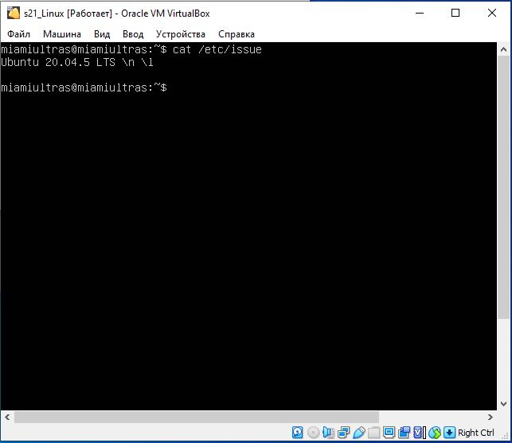
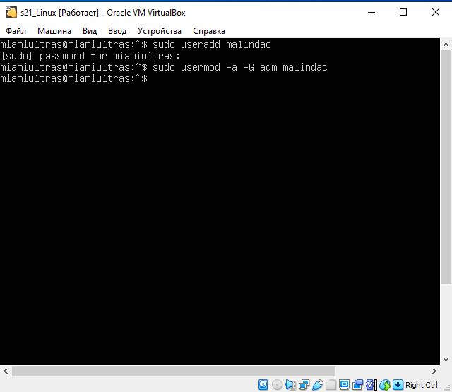
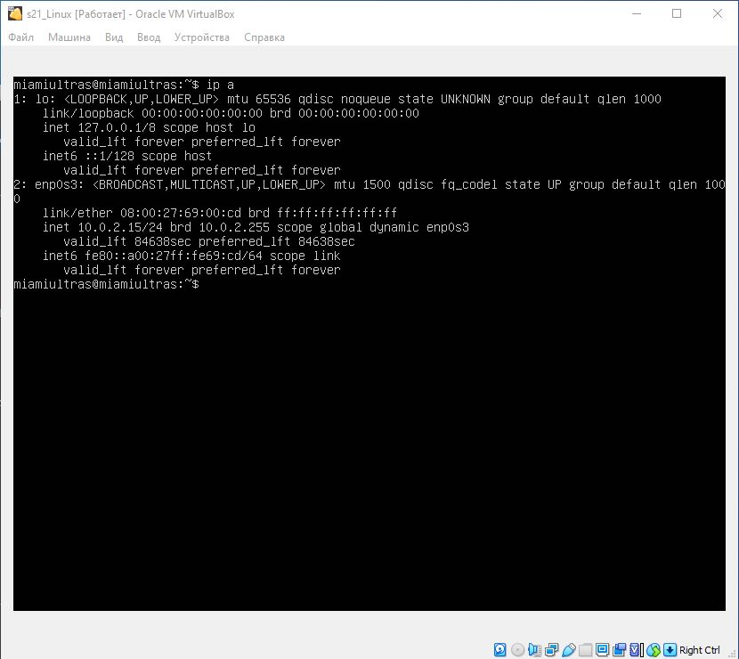
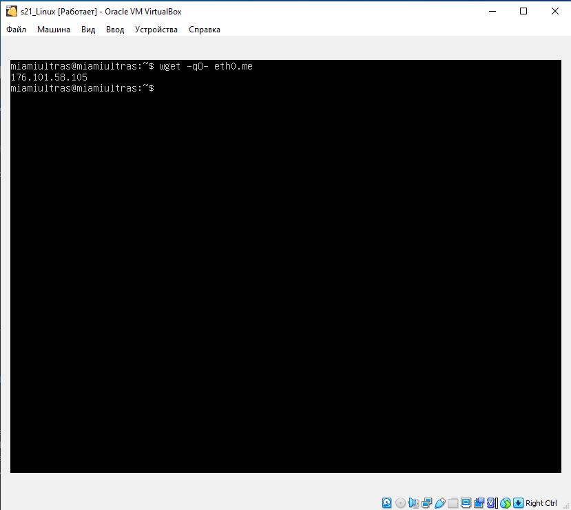
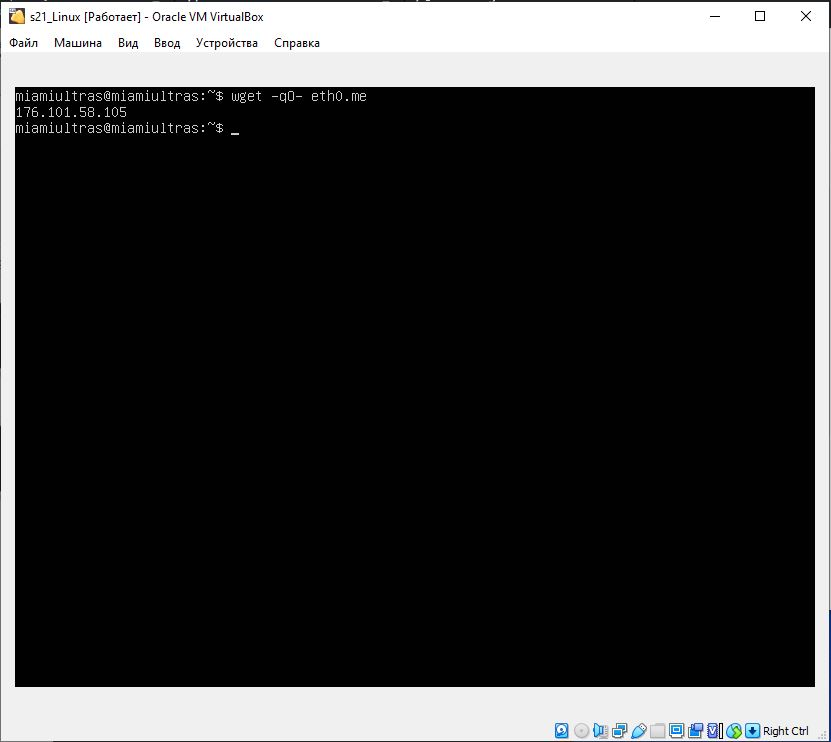
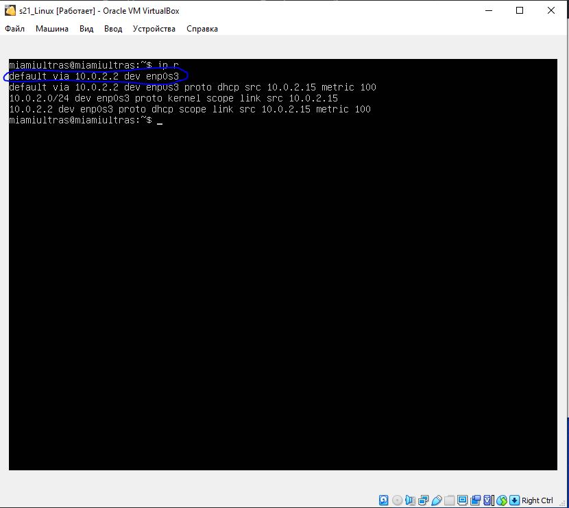

# UNIX/Linux operating systems (Basic)

Linux system installation and updates. Administration basics.

## Part 1. Installation of the OS

##### Install Ubuntu 20.04 Server LTS

cat /etc/issue

## Part 2. Creating a user

##### Create a user other than the one created during installation. The user must be added to adm group.

Creating a new user

cat /etc/passwd

## Part 3. Setting up OS network

##### Set the machine name as user-1

##### Set the time zone corresponding to your current location.

##### Output the names of the network interfaces using a console command.

##### In the report give an explanation for the presence of the lo interface.

Interface lo can be used by network client software to communicate with a server application located on the same computer. That is, if you specify the URL http://127.0.0.1/ or http://localhost/ in the web browser on the computer where the web server is running, it takes you to that computer's web site. This mechanism works without any active connection, so it is useful for testing services without compromising their security as with remote network access.

##### Use the console command to get the ip address of the device you are working on from the DHCP server.

Decode DHCP in the report.

Dynamic Host Configuration Protocol (DHCP) is a network management protocol used to automate the process of configuring devices on IP networks, thus allowing them to use network services such as DNS, NTP, and any communication protocol based on UDP or TCP. 

##### Define and display the external ip address of the gateway (ip) and the internal IP address of the gateway, aka default ip address (gw)

external IP address
A internal IP address is a range of non-internet facing IP addresses used in an internal network. Internal IP addresses are provided by network devices, such as routers, using network address translation.

internal IP address
A internal IP address is a range of non-internet facing IP addresses used in an internal network. Internal IP addresses are provided by network devices, such as routers, using network address translation.

##### Set static (manually set, not received from DHCP server) ip, gw, dns settings (use public DNS servers, e.g. 1.1.1.1 or 8.8.8.8).

sudo vim /etc/netplan/00-installer-config.yaml

make some changes

after all need to write "sudo netplan apply" to console, then reboot.

##### Reboot the virtual machine. Make sure that the static network settings (ip, gw, dns) correspond to those set in the previous point.

"ping -c 5 ya.ru" to ping 5 times and see the result. Same with 1.1.1.1

"ip r" to console, to check that our settings was saved.

## Part4. OS Update

##### Update the system packages to the latest version

sudo apt update to download updates.\n
sudo apt upgrade to install updates.

upgrade in progress

sudo apt update again, to check that all packages are up to date.
